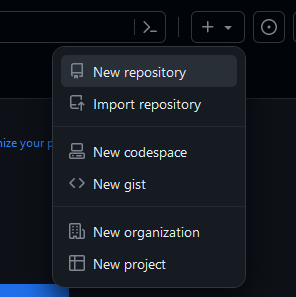
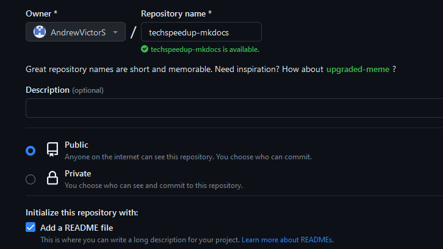
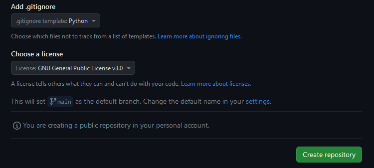
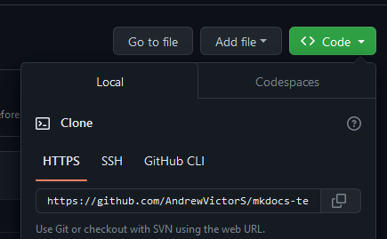

# Configuração e Criação

## Pre Requisitos

* Python
* Conta no Github & Github CLI
* VSCode

## Criando o repositório

Acessar sua conta do GitHub, no canto direito superior:

<figure markdown>
  { width="300" }
  <figcaption>Selecionar o "+" e "Novo repositório"</figcaption>
</figure>

### Nome & Permissão

Dê um nome para o seu repositório e deixe-o público.

<figure markdown>
  { width="500" }
</figure>

### .gitignore & Licença

Selecione o template de "Python" para o arquivo gitignore.  
Escolha a licença Geral *opcional* e crie o repositório.

<figure markdown>
  { width="500" }
  
</figure>

### Clonando o repositório

Na página inicial do repositório copie o endereço do seu repo:

<figure markdown>
  { width="500" }
  
</figure>

Pelo terminal/prompt/shell de sua prefência:

* `git clone [endereço-copiado]`

Finalizado o clone, acesse a pasta:

* `cd [nome-da-pasta]`

#### Venv
Agora criaremos um ambiente virtual para instalação do pacote:

* `python -m venv venv` - Cria o Virtual Environment
* `source venv/bin/activate` - Para ativar no Linux
* `source venv/Scripts/activate` - Para ativar no Windows

* `pip --version` - Valida se o gerenciador de pacotes está instalado

#### Install mkdocs

* `pip install mkdocs-material` - instala o pacote/biblioteca

#### Novo projeto

* `code .` - abre o editor de texto já na pasta criada com o ambiente configurado

No VSCode ou outro editor

Abre o terminal integrado

* `mkdocs new .` - ele criará um novo projeto a partir da estrura de pastas atual

Dois arquivos novos são criados: "mkdocs.yml" e "index.md"

Para iniciar o servidor local

* `mkdocs serve`

## Documentação Oficial

Para documentação completa, visite [mkdocs.org](https://www.mkdocs.org).

<!-- ## Project layout

    mkdocs.yml    # The configuration file.
    docs/
        index.md  # The documentation homepage.
        ...       # Other markdown pages, images and other files. -->
